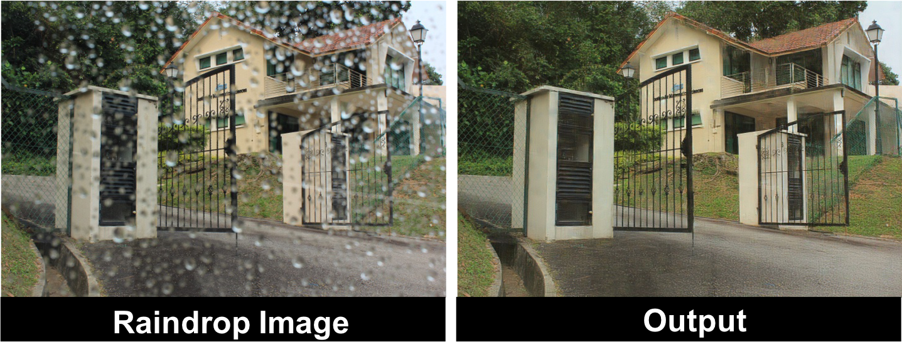

## Attentive Generative Adversarial Network for Raindrop Removal from A Single Image (CVPR'2018)

[Rui Qian](https://rui1996.github.io), [Robby T.Tan](https://tanrobby.github.io), [Wenhan Yang](http://www.icst.pku.edu.cn/struct/people/Wenhan_Yang_files/WenhanYang.html), Jiajun Su and [Jiaying Liu](http://www.icst.pku.edu.cn/struct/people/liujiaying.html) 

[[Paper Link]](https://arxiv.org/abs/1711.10098) [[Project Page]](https://rui1996.github.io/raindrop/raindrop_removal.html) [[Slides]]()(TBA)[[Video]]()(TBA) (CVPR'18 Spotlight) 

### Abstract

Raindrops adhered to a glass window or camera lens can severely hamper the visibility of a background scene and degrade an image considerably. In this paper, we address the problem by visually removing raindrops, and thus transforming a raindrop degraded image into a clean one. The problem is intractable, since first the regions occluded by raindrops are not given. Second, the information about the background scene of the occluded regions is completely lost for most part. To resolve the problem, we apply an attentive generative network using adversarial training. Our main idea is to inject visual attention into both the generative and discriminative networks. During the training, our visual attention learns about raindrop regions and their surroundings. Hence, by injecting this information, the generative network will pay more attention to the raindrop regions and the surrounding structures, and the discriminative network will be able to assess the local consistency of the restored regions. Apart from raindrop removal, this injection of visual attention to both generative and discriminative networks is another contribution of this paper. Our experiments show the effectiveness of our approach, which outperforms the state of the art methods quantitatively and qualitatively.

#### If you find the resource useful, please cite the following :- )

```
@InProceedings{Qian_2018_CVPR,
author = {Qian, Rui and Tan, Robby T. and Yang, Wenhan and Su, Jiajun and Liu, Jiaying},
title = {Attentive Generative Adversarial Network for Raindrop Removal From a Single Image},
booktitle = {The IEEE Conference on Computer Vision and Pattern Recognition (CVPR)},
month = {June},
year = {2018}
}
```

       


## Prerequisites:

1. Linux
2. Python 2.7
3. NVIDIA GPU + CUDA CuDNN (CUDA 8.0)

## Installation:

Install PyTorch and dependencies from http://pytorch.org 

## Demo 

Coming soon.

## Testing

Coming soon.

## Dataset

Coming soon.